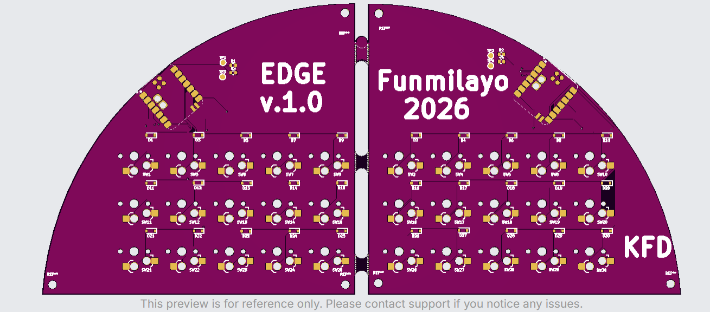

The name of this pretty keeb is Edge! You like it? :P

### DESIGN PHASE: VISUALISATION, SCHEMATIC AND PCB DESIGN

I started off with my split keyboard, after getting stuck on the devboard! I thought of a design, thought to use 30 keys in total - 26 alphabets and some other keys! I added everything necessary and 2 displays. (wanted to add LEDs until I realised the keys we used actually come with those already.. so no more!

I aligned each keyboard and diode with numbers/coordinates and all. That was quite tasking, tbh! But yayy, we got it done.

Once I figure out a couple other things, I will begin routing the PCB and start working on firmware!

## PCB routing

Yh, this took about an hour, I was just routing as usual. And I had a couple of questions like whether or not to route the 2 halves together.

I also placed the mousebites (I used a YT video to do this), added edge.cuts and all of that. I added some text design on silkscreen.

## ZMK firmware

This took a lot of reading, using Gemini, Chat GPT, and some YT videos.

I installed Github CLI and uv and ZMK by following the documentation on the ZMK website. I was also using Gemini in my browser to ask questions as I did it all.

Then I had to create a new keyboard. I was typically using many resources to do this. For example, I looked at someone else's keyboard firmware to see that they used the nice_nano, I used a YT video and I was trying to read the docs on the ZMK site as well. Ofc Gemini and GPT, my friends. I was trying my best to be quick with this after qaking up late today and needing to finish my board to make it to stasis, but I still took so much time.. OCD vibes. 

The YT video I found used ZMK, but just not for a split keyboard, but I just tried to understand the basic parts from there.

I'm still kinda working on it, but for the most part, I think I'm good.

## Changes

I thought of resizing my keeb by putting my micro at the back of the keys, but it woundn't go! So, I stuck with that!

Now done w the CAD, and we done. Spanned like a month over this project, but spent like 30 sumn hours in total!! Can't wait to routee!